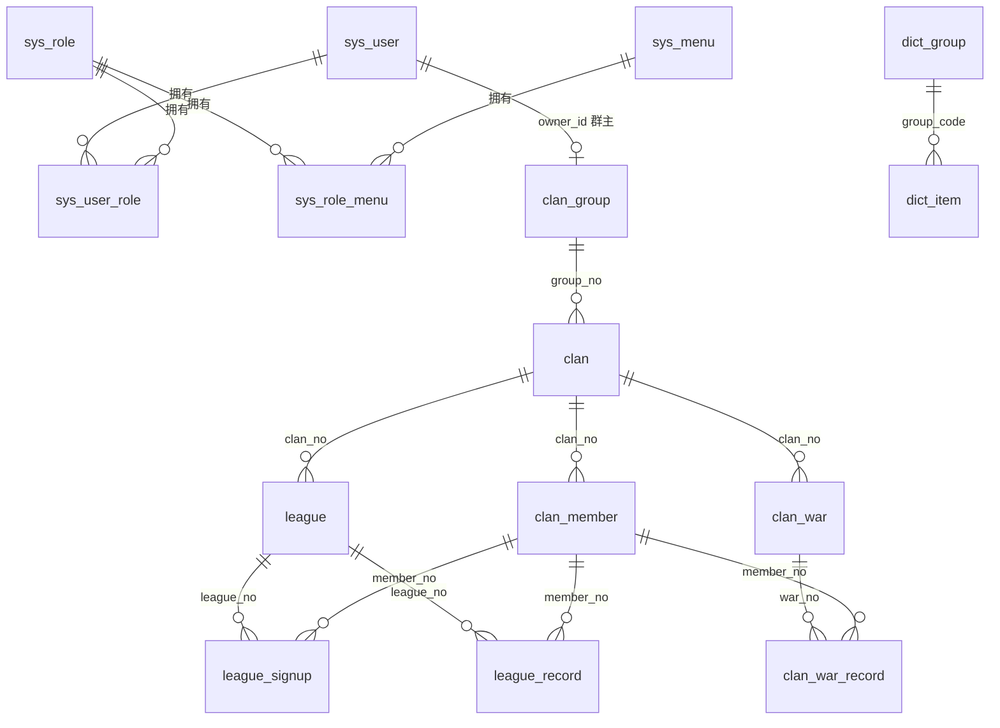

# COC 部落冲突数据后台管理系统 —— 后端设计文档

> 文档基于初步设想完善，仅描述后端设计（不含前端实现、不含业务代码）。
> 目标：管理部落冲突游戏数据，提供登录、看板统计、列表管理、表单编辑所需的接口能力。

---

## 一、系统架构与技术栈

### 1.1 技术栈
- 后端框架：Spring Boot 2.5.5（沿用现有模板）
- 持久层：升级为 **MyBatis-Plus**（`mybatis-plus-boot-starter`），复用 `BaseMapper` / `IService` 通用 CRUD 与分页插件，替代原生 MyBatis
- 数据库：MySQL（沿用 `application.yml` 数据源配置；MyBatis-Plus 实体扫描 + 可选 XML 混合）
- 鉴权：JWT（登录签发 Token，拦截器解析并注入当前用户上下文）
- 统一响应：沿用现有 `com.tencent.wxcloudrun.config.ApiResponse`（字段：`code` / `errorMsg` / `data`）

### 1.2 分层架构

```
Client(前端/接口) 
   │
   ▼
[JWT 拦截器 + group_no 数据隔离拦截器]
   │
   ▼
Controller  →  Service / ServiceImpl  →  MyBatis-Plus Mapper  →  MySQL
   ▲
   │
Config (MyBatisPlusConfig：分页插件 + 多租户/group_no 隔离插件)
```

### 1.3 后端包结构约定
沿用根包 `com.tencent.wxcloudrun`，新增 / 调整如下：

```
com.tencent.wxcloudrun
├── WxCloudRunApplication
├── config
│   ├── ApiResponse            # 已有，统一响应
│   ├── MyBatisPlusConfig      # 分页插件 + group_no 数据隔离插件
│   ├── JwtInterceptor         # 登录鉴权拦截器
│   └── WebConfig              # 注册拦截器、放行白名单
├── entity
│   ├── BaseEntity             # 基类：id/createdAt/updatedAt/deleted/groupNo
│   ├── sys.*                  # 系统表实体
│   └── biz.*                  # 业务表实体
├── mapper                    # MyBatis-Plus Mapper（extends BaseMapper<T>）
├── service / service.impl     # IService<T> / ServiceImpl<M,T>
├── controller
├── dto                       # 请求/响应对象、分页查询条件
└── config/security           # 角色权限常量、当前用户上下文(UserContext)
```

### 1.4 实体基类 BaseEntity
所有业务实体继承，统一公共字段：
- `id`：`Long`，自增主键
- `createdAt` / `updatedAt`：`LocalDateTime`
- `createdBy` / `updatedBy`：`String(32)`，创建者 / 修改者（用户编号或账号）
- `deleted`：`Integer`（逻辑删除，0=未删 1=已删，MyBatis-Plus `@TableLogic`）
- `groupNo`：`String(32)`，数据隔离键（字典类与纯系统表除外）

---

## 二、数据库设计

### 2.1 通用字段约定
| 约定项 | 取值 |
|--------|------|
| 主键 | `id BIGINT AUTO_INCREMENT` |
| 编号类 | `VARCHAR(32)`，唯一索引 |
| 名称类 | `VARCHAR(64)` |
| 状态/枚举 | `TINYINT`，默认 0 |
| 时间（业务） | `DATETIME` |
| 比率 | `DECIMAL(5,2)` |
| 数量/次数 | `INT` |
| 简介/备注 | `VARCHAR(500)` |
| 公共字段 | 各表含 `created_at`、`updated_at`、`created_by`、`updated_by`、`deleted`；业务表另含 `group_no` |

> 字符集统一 `utf8mb4`，引擎 `InnoDB`。

### 2.2 系统 / 权限表

**sys_user（用户表，原 design.txt 遗漏，本次补全）**
| 字段 | 类型 | 说明 |
|------|------|------|
| id | BIGINT PK | 用户ID |
| username | VARCHAR(32) | 登录账号，唯一 |
| password | VARCHAR(64) | 密码（BCrypt 加密） |
| nickname | VARCHAR(64) | 昵称 |
| phone | VARCHAR(20) | 手机号，可空 |
| group_no | VARCHAR(32) | 所属群组编号（超级管理员可为空，表示跨群组） |
| status | TINYINT | 启用状态：0=禁用 1=启用 |
| created_at / updated_at | DATETIME | |
| created_by | VARCHAR(32) | 创建者 |
| updated_by | VARCHAR(32) | 修改者 |
| deleted | TINYINT | 逻辑删除 |

**sys_role（角色表）**
| 字段 | 类型 | 说明 |
|------|------|------|
| id | BIGINT PK | 角色ID |
| role_code | VARCHAR(32) | 角色编码：SUPER_ADMIN / GROUP_OWNER / ADMIN / MEMBER |
| role_name | VARCHAR(64) | 角色名称：超级管理员/群主/普通管理员/部落成员 |
| remark | VARCHAR(255) | 备注 |
| created_at / updated_at | DATETIME | |
| created_by | VARCHAR(32) | 创建者 |
| updated_by | VARCHAR(32) | 修改者 |
| deleted | TINYINT | |

**sys_menu（菜单表）**
| 字段 | 类型 | 说明 |
|------|------|------|
| id | BIGINT PK | 菜单ID |
| parent_id | BIGINT | 父菜单ID，0=顶级 |
| menu_name | VARCHAR(64) | 菜单名称 |
| menu_type | TINYINT | 类型：0=目录 1=菜单 2=按钮 |
| permission | VARCHAR(64) | 权限标识（用于接口鉴权，如 `clan:add`） |
| path | VARCHAR(128) | 路由/接口路径 |
| sort | INT | 排序 |
| created_at / updated_at | DATETIME | |
| created_by | VARCHAR(32) | 创建者 |
| updated_by | VARCHAR(32) | 修改者 |
| deleted | TINYINT | |

**sys_role_menu（角色菜单表）**
| 字段 | 类型 | 说明 |
|------|------|------|
| id | BIGINT PK | |
| created_by | VARCHAR(32) | 创建者 |
| updated_by | VARCHAR(32) | 修改者 |
| role_id | BIGINT | 角色ID |
| menu_id | BIGINT | 菜单/权限ID |
| UNIQUE(role_id, menu_id) | | |

**sys_user_role（用户角色表）**
| 字段 | 类型 | 说明 |
|------|------|------|
| id | BIGINT PK | |
| created_by | VARCHAR(32) | 创建者 |
| updated_by | VARCHAR(32) | 修改者 |
| user_id | BIGINT | 用户ID |
| role_id | BIGINT | 角色ID |
| UNIQUE(user_id, role_id) | | |

### 2.3 数据字典表（全局，无 group_no）

**dict_group（数据字典组表）**
| 字段 | 类型 | 说明 |
|------|------|------|
| id | BIGINT PK | |
| group_name | VARCHAR(64) | 字典组名称 |
| group_code | VARCHAR(32) | 字典组编号，唯一 |
| status | TINYINT | 启用状态 0=禁用 1=启用 |
| remark | VARCHAR(255) | |
| created_at / updated_at | DATETIME | |
| created_by | VARCHAR(32) | 创建者 |
| updated_by | VARCHAR(32) | 修改者 |
| deleted | TINYINT | |

**dict_item（数据字典项表）**
| 字段 | 类型 | 说明 |
|------|------|------|
| id | BIGINT PK | |
| item_name | VARCHAR(64) | 字典项名称 |
| item_value | VARCHAR(32) | 字典项值 |
| group_code | VARCHAR(32) | 字典组编号（逻辑外键 → dict_group.group_code） |
| status | TINYINT | 启用状态 0=禁用 1=启用 |
| sort | INT | 排序 |
| created_at / updated_at | DATETIME | |
| created_by | VARCHAR(32) | 创建者 |
| updated_by | VARCHAR(32) | 修改者 |
| deleted | TINYINT | |
| UNIQUE(group_code, item_value) | | |

> 业务表的状态/枚举字段（如晋级状态、报名状态）统一以 `字典项值` 存储，通过 `group_code` 关联字典组，保证取值一致性。

### 2.4 业务表（均含 group_no 隔离键）

**clan_group（部落群组表）**
| 字段 | 类型 | 说明 |
|------|------|------|
| id | BIGINT PK | |
| group_name | VARCHAR(64) | 群组名称 |
| group_no | VARCHAR(32) | 群组编号，唯一 |
| owner_id | BIGINT | 群主用户ID（逻辑外键 → sys_user.id） |
| intro | VARCHAR(500) | 简介 |
| status | TINYINT | 状态 0=停用 1=启用 |
| created_at / updated_at | DATETIME | |
| created_by | VARCHAR(32) | 创建者 |
| updated_by | VARCHAR(32) | 修改者 |
| deleted | TINYINT | |

**clan（部落表）**
| 字段 | 类型 | 说明 |
|------|------|------|
| id | BIGINT PK | |
| clan_name | VARCHAR(64) | 部落名称 |
| clan_no | VARCHAR(32) | 部落编号，唯一 |
| group_no | VARCHAR(32) | 所属群组编号 |
| intro | VARCHAR(500) | 简介 |
| created_at / updated_at | DATETIME | |
| created_by | VARCHAR(32) | 创建者 |
| updated_by | VARCHAR(32) | 修改者 |
| deleted | TINYINT | |
| INDEX(group_no) | | |

**clan_member（部落成员表）**
| 字段 | 类型 | 说明 |
|------|------|------|
| id | BIGINT PK | |
| member_name | VARCHAR(64) | 成员名称 |
| member_no | VARCHAR(32) | 成员编号，群组内唯一 |
| clan_no | VARCHAR(32) | 所属部落编号（成员可在不同部落间移动） |
| group_no | VARCHAR(32) | 所属群组编号 |
| war_status | TINYINT | 参战状态 0=不参战 1=参战（字典项） |
| intro | VARCHAR(500) | 简介 |
| user_id | BIGINT | 关联系统用户（可空） |
| created_at / updated_at | DATETIME | |
| created_by | VARCHAR(32) | 创建者 |
| updated_by | VARCHAR(32) | 修改者 |
| deleted | TINYINT | |
| INDEX(group_no), INDEX(clan_no) | | |

> **成员唯一性与写入规则**：同一群组（group_no）下，同一成员仅存在一条记录。
> - 成员名称与成员编号的唯一性均以**整个群组**为范围校验（不再限制为同一个部落）。
> - 成员可在不同部落间移动：通过修改记录的 `clan_no` 实现换部落，原记录保留，其关联的联赛战绩、报名等记录随之归属到该成员（按 `member_no` 关联）。
> - 新增 / 编辑 / 导入时：填了成员编号则校验群组内编号唯一；未填编号则校验群组内名称（含备用名称）唯一，重名时要求补充编号或自动生成 10 位（数字+小写字母）编号。
> - 成员合并（/merge）仅限同一群组下的两条记录，不限制是否同部落。

**league（联赛表）**
| 字段 | 类型 | 说明 |
|------|------|------|
| id | BIGINT PK | |
| league_name | VARCHAR(64) | 联赛名称 |
| league_no | VARCHAR(32) | 联赛编号，唯一 |
| clan_no | VARCHAR(32) | 所属部落编号 |
| group_no | VARCHAR(32) | 所属群组编号 |
| signup_start | DATETIME | 报名开始时间 |
| signup_end | DATETIME | 报名截止时间 |
| tier | VARCHAR(32) | 联赛段位（字典项） |
| result_rank | INT | 联赛结果排名 |
| extra_count | INT | 联赛额外个数 |
| league_coin | INT | 联赛币数量 |
| extra_coin | INT | 额外币数量 |
| promote_status | TINYINT | 晋级状态：1=晋级 2=保级 3=掉级（字典项） |
| intro | VARCHAR(500) | 简介 |
| created_at / updated_at | DATETIME | |
| created_by | VARCHAR(32) | 创建者 |
| updated_by | VARCHAR(32) | 修改者 |
| deleted | TINYINT | |
| INDEX(group_no), INDEX(clan_no) | | |

**league_signup（联赛报名表）**
| 字段 | 类型 | 说明 |
|------|------|------|
| id | BIGINT PK | |
| member_name | VARCHAR(64) | 成员名称 |
| member_no | VARCHAR(32) | 成员编号 |
| league_no | VARCHAR(32) | 所属联赛编号 |
| clan_no | VARCHAR(32) | 所属部落编号 |
| group_no | VARCHAR(32) | 所属群组编号 |
| signup_status | TINYINT | 报名状态：1=未报名 2=主动报名 3=协助报名（字典项） |
| signup_time | DATETIME | 报名时间 |
| created_at / updated_at | DATETIME | |
| created_by | VARCHAR(32) | 创建者 |
| updated_by | VARCHAR(32) | 修改者 |
| deleted | TINYINT | |
| INDEX(group_no), INDEX(league_no) | | |

**league_record（联赛成员战绩表）**
| 字段 | 类型 | 说明 |
|------|------|------|
| id | BIGINT PK | |
| member_name | VARCHAR(64) | 成员名称 |
| member_no | VARCHAR(32) | 成员编号 |
| league_no | VARCHAR(32) | 所属联赛编号 |
| clan_no | VARCHAR(32) | 所属部落编号 |
| group_no | VARCHAR(32) | 所属群组编号 |
| win_stars | INT | 胜利之星 |
| destroy_rate | INT | 摧毁率（整数百分比，0–100） |
| actual_attacks | INT | 实进攻次数 |
| required_attacks | INT | 应进攻次数 |
| has_extra | TINYINT | 是否有额外：0=否 1=是 |
| created_at / updated_at | DATETIME | |
| created_by | VARCHAR(32) | 创建者 |
| updated_by | VARCHAR(32) | 修改者 |
| deleted | TINYINT | |
| INDEX(group_no), INDEX(league_no) | | |

**clan_war（部落战表）**
| 字段 | 类型 | 说明 |
|------|------|------|
| id | BIGINT PK | |
| war_no | VARCHAR(32) | 部落战编号，唯一 |
| clan_no | VARCHAR(32) | 所属部落编号 |
| group_no | VARCHAR(32) | 所属群组编号 |
| win_status | TINYINT | 胜利状态：1=胜 2=平 3=败（字典项） |
| start_time | DATETIME | 发起时间 |
| intro | VARCHAR(500) | 简介 |
| created_at / updated_at | DATETIME | |
| created_by | VARCHAR(32) | 创建者 |
| updated_by | VARCHAR(32) | 修改者 |
| deleted | TINYINT | |
| INDEX(group_no), INDEX(clan_no) | | |

**clan_war_record（部落战成员战绩表）**
| 字段 | 类型 | 说明 |
|------|------|------|
| id | BIGINT PK | |
| member_name | VARCHAR(64) | 成员名称 |
| member_no | VARCHAR(32) | 成员编号 |
| war_no | VARCHAR(32) | 所属部落战编号 |
| clan_no | VARCHAR(32) | 所属部落编号 |
| group_no | VARCHAR(32) | 所属群组编号 |
| atk1_stars | INT | 第一次进攻胜利之星 |
| atk1_rate | INT | 第一次进攻摧毁率（整数百分比，0–100） |
| atk2_stars | INT | 第二次进攻胜利之星 |
| atk2_rate | INT | 第二次进攻摧毁率（整数百分比，0–100） |
| actual_attacks | INT | 实进攻次数 |
| created_at / updated_at | DATETIME | |
| created_by | VARCHAR(32) | 创建者 |
| updated_by | VARCHAR(32) | 修改者 |
| deleted | TINYINT | |
| INDEX(group_no), INDEX(war_no) | | |

### 2.5 枚举取值约定（写入字典组）
| 字典组 code | 字典项（value / 含义） |
|-------------|------------------------|
| war_status | 0=不参战, 1=参战 |
| promote_status | 1=晋级, 2=保级, 3=掉级 |
| signup_status | 1=未报名, 2=主动报名, 3=协助报名 |
| win_status | 1=胜, 2=平, 3=败 |
| has_extra | 0=否, 1=是 |
| enable_status | 0=禁用, 1=启用 |

---

## 三、ER 关系与权限设计

### 3.1 ER 关系图


> 业务表之间的关联以 `编号`（group_no / clan_no / league_no / war_no / member_no）作为逻辑外键，不使用物理外键以保证灵活度。

### 3.2 角色权限矩阵
| 功能模块 | 超级管理员 | 群主 | 普通管理员 | 部落成员 |
|----------|-----------|------|-----------|----------|
| 群组管理（CRUD / 绑定群主） | ✅ | ❌ | ❌ | ❌ |
| 角色 / 菜单 / 权限管理 | ✅ | ❌ | ❌ | ❌ |
| 数据字典管理 | ✅ | ❌ | ❌ | ❌ |
| 部落管理（本群组） | ✅(全部) | ✅ | ❌ | ❌ |
| 成员管理 | ✅(全部) | ✅ | ✅(本群组) | ❌ |
| 添加普通管理员 / 成员 | ✅ | ✅ | ❌ | ❌ |
| 联赛 / 部落战管理 | ✅(全部) | ✅(本群组) | ✅(本群组) | 仅查看/报名 |
| 联赛报名 | ✅(全部) | ✅(本群组) | ✅(本群组) | ✅(本人) |
| 战绩录入 / 查看 | ✅(全部) | ✅(本群组) | ✅(本群组) | 仅本人录入 |
| 数据看板统计 | ✅(全局) | ✅(本群组) | ✅(本群组) | ✅(本群组) |

### 3.3 group_no 数据隔离方案
1. **隔离范围**：除 `sys_*` 系统表、`dict_*` 字典表外，所有业务表均含 `group_no` 字段。
2. **隔离规则**：
   - 超级管理员：`group_no` 为空，可查询/操作全部群组数据。
   - 群主 / 普通管理员 / 部落成员：`group_no` = 登录用户所属群组，仅能访问本群组业务数据。
3. **实现方式**：使用 MyBatis-Plus **多租户插件（TenantLineInnerInterceptor）**，以 `group_no` 为租户键，在 SQL 解析阶段自动追加 `WHERE group_no = #{当前用户groupNo}`。
4. **兜底**：拦截器在请求入口解析 JWT，写入 `UserContext`（userId / groupNo / roleCode），Service 层如需动态条件（如群主跨本人）可读取上下文手动拼装，避免业务代码遗漏隔离条件。

---

## 四、API 接口与通用约定

### 4.1 统一响应
沿用 `ApiResponse`：成功 `ApiResponse.ok(data)`，失败 `ApiResponse.error(msg)`。
分页出参结构（data 内）：`{ records: [...], total: Long, pageNum: Int, pageSize: Int }`。

### 4.2 鉴权约定
- 登录接口放行；其余接口需请求头 `Authorization: Bearer <token>`。
- `JwtInterceptor` 校验 Token，解析后注入 `UserContext`。
- 权限标识（menu.permission，如 `clan:add`）由拦截器按角色菜单映射校验。
- 白名单：`/api/auth/login`、`/api/auth/register`、静态资源。

### 4.3 分页 / 查询约定
- 入参：`pageNum`（默认 1）、`pageSize`（默认 10）。
- 使用 MyBatis-Plus `Page<T>` + 分页插件，自动 `count` 与 `limit`。
- 列表查询支持按 `group_no` 自动隔离（插件完成），业务条件由 DTO 传入。

### 4.4 接口与页面地址命名规范
- 统一采用 **小驼峰（camelCase）** 命名。接口地址与前端页面/路由地址中，**禁止使用中划线（kebab-case，如 `role-options`）和下划线（snake_case，如 `role_options`）**。
- 一个路径段内由多个单词组成时，从第二个单词起首字母大写，例如：
  - `role-options` → `roleOptions`
  - `war-stat` → `warStat`
  - `combat-power/config` → `combatPower/config`
  - `clan-members` → `clanMembers`
  - `set-admin` → `setAdmin`
  - `cancel-admin` → `cancelAdmin`
  - `check-members` → `checkMembers`
  - `assign-role` → `assignRole`
- 路径段之间仍用 `/` 分隔（如 `/api/clan/group/user`）。`/` 是层级分隔符而非命名风格，保持不变。
- 该规范同时约束后端 `@RequestMapping`/`@GetMapping` 等注解路径，以及前端 `api.js`、`api.js` 封装的方法、页面路由、菜单 `path` 等所有地址，前后端必须保持一致。

### 4.5 RESTful 接口清单（按模块）

**认证模块 /api/auth**
| 方法 | 路径 | 说明 | 权限 |
|------|------|------|------|
| POST | /api/auth/register | 注册账号 | 开放 |
| POST | /api/auth/login | 登录签发 JWT | 开放 |
| GET | /api/auth/info | 获取当前用户信息/菜单 | 登录 |

**系统管理 /api/sys**
| 方法 | 路径 | 说明 | 权限 |
|------|------|------|------|
| GET/POST/PUT/DELETE | /api/sys/role | 角色 CRUD | 超级管理员 |
| GET/POST/PUT/DELETE | /api/sys/menu | 菜单 CRUD | 超级管理员 |
| GET/POST/PUT/DELETE | /api/sys/user | 用户 CRUD | 超级管理员/群主 |
| GET/POST/PUT/DELETE | /api/sys/group | 群组 CRUD / 绑定群主 | 超级管理员 |

**数据字典 /api/dict**
| 方法 | 路径 | 说明 | 权限 |
|------|------|------|------|
| GET/POST/PUT/DELETE | /api/dict/group | 字典组 CRUD | 超级管理员 |
| GET/POST/PUT/DELETE | /api/dict/item | 字典项 CRUD | 超级管理员 |

**部落业务 /api/clan**
| 方法 | 路径 | 说明 | 权限 |
|------|------|------|------|
| GET/POST/PUT/DELETE | /api/clan | 部落 CRUD | 超级管理员/群主 |
| GET/POST/PUT/DELETE | /api/clan/member | 成员 CRUD | 群主/普通管理员 |
| POST | /api/clan/member/signup | 联赛报名（成员本人） | 部落成员 |

**联赛业务 /api/league**
| 方法 | 路径 | 说明 | 权限 |
|------|------|------|------|
| GET/POST/PUT/DELETE | /api/league | 联赛 CRUD | 群主/普通管理员 |
| GET/POST/PUT/DELETE | /api/league/record | 联赛成员战绩 CRUD | 群主/普通管理员/成员本人 |
| GET | /api/league/signup/list | 联赛报名列表 | 登录 |

**部落战业务 /api/war**
| 方法 | 路径 | 说明 | 权限 |
|------|------|------|------|
| GET/POST/PUT/DELETE | /api/war | 部落战 CRUD | 群主/普通管理员 |
| GET/POST/PUT/DELETE | /api/war/record | 部落战成员战绩 CRUD | 群主/普通管理员/成员本人 |

**数据看板 /api/dashboard**
| 方法 | 路径 | 说明 | 权限 |
|------|------|------|------|
| GET | /api/dashboard/overview | 总数统计（群组/部落/成员/联赛） | 登录 |
| GET | /api/dashboard/warStat | 部落战胜负统计 | 登录 |
| GET | /api/dashboard/leagueRank | 联赛排名/段位分布 | 登录 |

> 所有列表/统计接口在 SQL 层自动附带 `group_no` 隔离条件（超级管理员除外）。

---

## 五、落地补充备注
- 不改动现有 `Counter` 计数器示例逻辑，新模块独立包/表。
- 数据库建表 SQL（`db.sql`）与实体类在后续实现阶段按本文档生成。
- 时间字段统一 `LocalDateTime`，Jackson 序列化配置 UTC/本地时区。
- 密码使用 BCrypt 加密存储，JWT 设置合理过期时间（建议 2h）并支持刷新。
